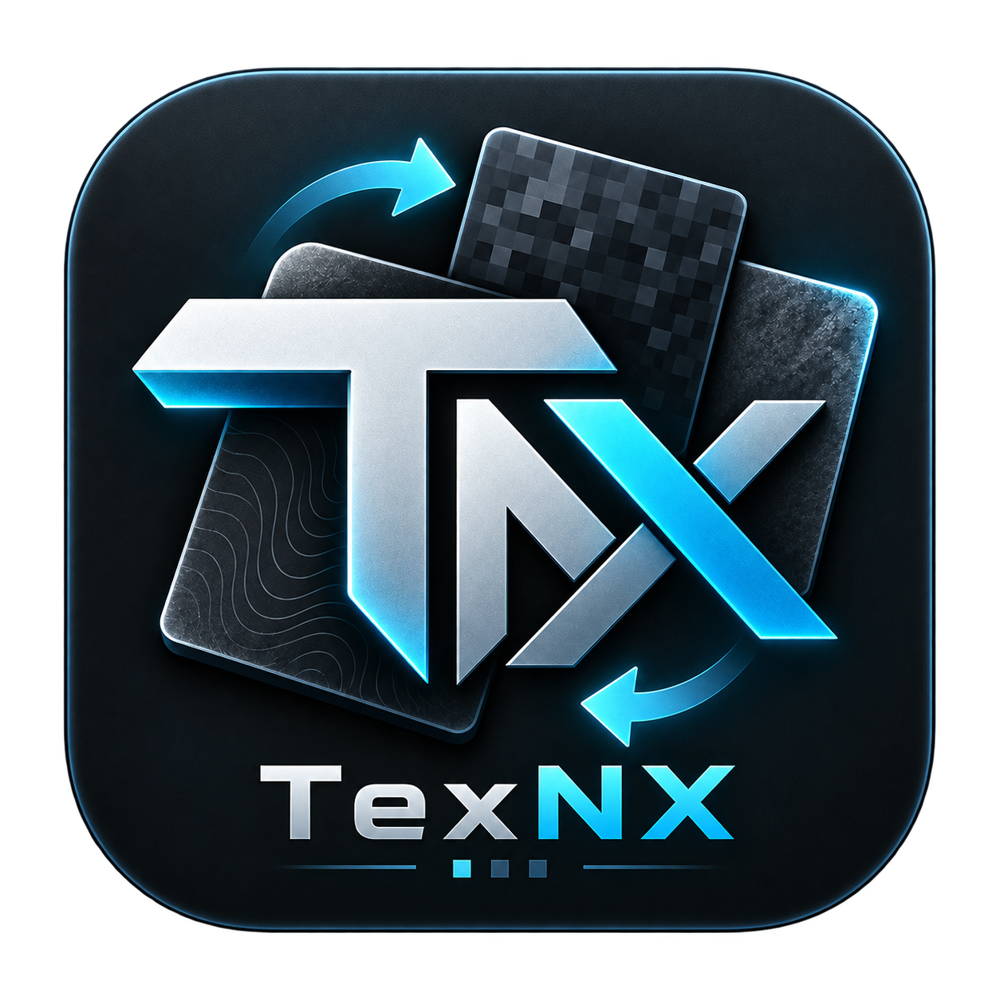

[English](README.md) | [日本語](README_JA.md)

<p align="center">
  
</p>

<h1 align="center">TexNX</h1>

<p align="center">
  A focused texture pack switcher for Minecraft: Nintendo Switch Edition.<br>
  <strong>Latest stable release: v1.0.0</strong>
</p>

## Overview

TexNX is an unofficial Nintendo Switch homebrew application for listing and switching locally installed texture packs for **Minecraft: Nintendo Switch Edition**. It is designed for Atmosphère LayeredFS and targets title ID `01006BD001E06000`.

The interface is intentionally focused: select a texture pack, apply it safely, or return to the game's built-in textures. TexNX does not download packs and does not include game data.

## Features

- Sidebar interface with `Textures`, `Settings`, and `About` pages
- Controller and touch input through Borealis
- English and Japanese interface languages, with `System` as the default
- Texture pack names, optional descriptions, and optional pack icons
- Embedded fallback icon for packs with a missing or unsupported icon
- Confirmation dialog and non-blocking progress display during apply operations
- Streaming copy and SHA-256 verification without loading whole packs into memory
- Current texture detection from the actual LayeredFS `Common` directory
- Safe return to the game's built-in `Default` textures
- `PLUS` to exit during normal operation

## Requirements

| Item | Requirement |
| --- | --- |
| Console | Nintendo Switch capable of running homebrew |
| CFW | Atmosphère with LayeredFS support |
| Game | Minecraft: Nintendo Switch Edition |
| Title ID | `01006BD001E06000` |
| Languages | English / Japanese |

TexNX is not intended for Minecraft Bedrock Edition or other title IDs.

## Installation

Download `TexNX.zip` from the [latest GitHub Release](https://github.com/IGNSeed/TexNX/releases/latest) and extract it to the root of your SD card. The archive is arranged as follows:

```text
switch/
├── TexNX.nro
└── TexNX/
    └── Textures/
```

After extraction, these paths will exist:

```text
sdmc:/switch/TexNX.nro
sdmc:/switch/TexNX/Textures/
```

Alternatively, download `TexNX.nro`, place it at `sdmc:/switch/TexNX.nro`, and create `sdmc:/switch/TexNX/Textures/` for your packs.

## Texture pack structure

Each pack is a directory directly below `Textures` and must contain a `Common` directory:

```text
sdmc:/switch/TexNX/Textures/<Pack>/Common/
├── res/
│   ├── gui/
│   │   └── pack_icon.png    # Optional
│   └── description.txt          # Optional; first UTF-8 line
└── ...                               # Texture pack files
```

The `<Pack>` directory name is used as the display name. Packs without `Common` are not listed. If `pack_icon.png` is missing, damaged, or unsupported, TexNX displays its embedded default texture icon.

## How to use

1. Close Minecraft before modifying its LayeredFS files. TexNX does not check whether the game is running.
2. Open TexNX from Homebrew Menu.
3. Choose `Textures` in the Sidebar with `UP` / `DOWN`.
4. Press `A` or `RIGHT` to enter the texture list.
5. Select a pack and press `A`, then confirm the operation. Touch selection is also supported.
6. Wait for the progress dialog to complete. Apply operations cannot be cancelled midway.
7. Select `Default` to remove the LayeredFS `Common` directory and return to the textures built into the game.

Press `LEFT` or `B` in Content to return to the Sidebar. Press `PLUS` to exit during normal operation. Normal input and exit actions are blocked while an apply operation is writing or verifying files.

## Current Texture states

The Current Texture card is derived from the actual Minecraft LayeredFS files rather than a saved selection:

| State | Meaning |
| --- | --- |
| `Default` | The LayeredFS `Common` directory does not exist. The game uses its built-in content. |
| Known pack | `Common` exactly matches one listed pack, including paths, directories, sizes, and file contents. |
| `External / Unknown` | `Common` exists, but no listed pack has the same complete SHA-256 fingerprint. |
| Error | TexNX could not inspect the required filesystem state. |

Manually installed `Common` content is recognized as a known pack only when it fully matches one of the currently listed packs.

## Apply behavior and safety

TexNX applies a pack in this order:

1. Fully enumerate and read the source `Common` as a preflight check.
2. Remove the existing Minecraft LayeredFS `Common` completely.
3. Create a new destination tree.
4. Stream the source files into the destination using a reusable 128 KiB buffer.
5. Compare the preflight, copy-time source, and destination read-back fingerprints.
6. Update the Current Texture display only after verification succeeds.

The source at `sdmc:/switch/TexNX/Textures/<Pack>/Common` is read-only from TexNX's perspective: it is copied, never moved, renamed, deleted, or modified. If preflight fails, the existing destination is left untouched. If copying or verification fails after removal starts, TexNX attempts to delete the incomplete destination.

TexNX writes only within these locations:

```text
sdmc:/switch/TexNX/
sdmc:/switch/TexNX/config.json
sdmc:/switch/TexNX/config.json.tmp
sdmc:/switch/TexNX/Textures/
sdmc:/atmosphere/contents/01006BD001E06000/romfs/Common/
```

TexNX does **not** create persistent backups, rollback archives, or backup restore points. Returning to `Default` means deleting the LayeredFS `Common`; it is not a backup restore. TexNX also has no theme switcher.

## Build from source

The project uses CMake, devkitPro, devkitA64, libnx, deko3d, uam, switch-glm, and a pinned Borealis submodule. CMake 3.20 or newer and Ninja are recommended. Borealis requires C++20.

```sh
git clone https://github.com/IGNSeed/TexNX.git
cd TexNX
git submodule update --init external/borealis

export DEVKITPRO=/opt/devkitpro
export DEVKITA64="$DEVKITPRO/devkitA64"

cmake -S . -B build -G Ninja \
  -DCMAKE_TOOLCHAIN_FILE="$DEVKITPRO/cmake/Switch.cmake"
cmake --build build --parallel
```

Use a devkitPro MSYS2 shell on Windows, or another environment with the Switch toolchain installed. MSVC and ordinary desktop MinGW compilers are not supported. The NRO is generated at `build/TexNX.nro`.

To create the same SD-card archive layout used by the official release:

```sh
cmake --build build --target TexNXRelease
```

This creates `build/release/TexNX.zip`. The app icon, shaders, localization resources, Material Icons font, and default texture fallback icon are embedded in the NRO. Build artifacts are not tracked by Git.

## Release contents

The v1.0.0 GitHub Release contains exactly two downloadable assets:

- `TexNX.nro` — standalone homebrew application
- `TexNX.zip` — ready-to-extract SD card package

Neither asset contains Minecraft files, Nintendo files, texture packs, Atmosphère binaries, or keys.

## License

TexNX source code is available under the [MIT License](LICENSE). The pinned [XITRIX/borealis](https://github.com/XITRIX/borealis) dependency is provided under the Apache License 2.0. Its required Material Icons font and license are embedded as runtime resources.

## Disclaimer

TexNX is an unofficial community project. It is not affiliated with, endorsed by, sponsored by, or supported by Nintendo, Mojang Studios, or Microsoft. This repository does not contain game data, extracted game assets, ROMs, keys, or official Atmosphère distribution binaries.
